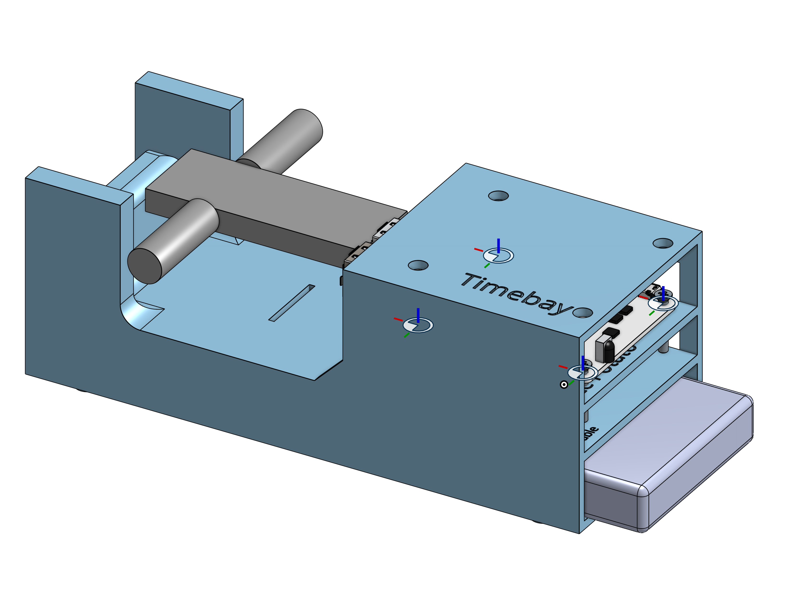

# CAD

This directory holds the CAD files for the boxes used to hold nodes.

View the OnShape
source [here](https://cad.onshape.com/documents/eca78c23cf623a8ee2aef306/w/7645614f6dc16000e8edd940/e/3784cc69f371b8e9440601d2).

I recommend printing these vertically if possible, as it significantly improves the print.

The slot in the middle of the box is designed to hold velcro, which can be used to extract the battery if it is pushed
into the
box (insert the Velcro from top to bottom first, then push in the battery, then pull the Velcro to remove battery)