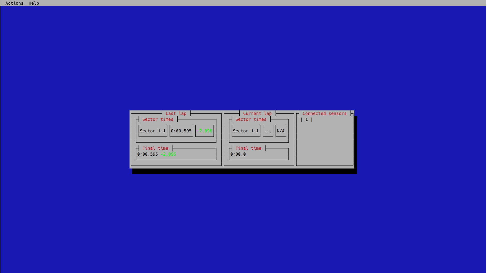

# Timebay

Timebay is a distributed system that provides two services to student vehicles in testing:
1. Sector timing (and splits)
2. Wireless network access

It does this by creating a mesh network of sensor nodes, where each sensor node contains a mesh point for other sensor nodes, 
vehicles, and clients to connect to. Timing data passes through this mesh, as does any user applications used, such as video feeds,
ROS topics and more. To connect to the timing services of Timebay, a TUI is provided.

For more details on the design, operations, and performance of Timebay, please see [the docs](./docs) and [the paper](./docs/Timebay.pdf).

Features:
- **Unlimited Scalability** - Add as many sectors as you need / can afford.
- **Resiliency** - Timebay is designed to do everything it can to ensure your practice day keeps moving. So long as one node keeps working, the system can continue smoothly operating, automatically healing if a node comes back online.
- **Flexibility** - Want to change up your sectors? Go ahead! Just press the zero sensors button when you're done and Timebay will handle all the routing needed to ensure smooth operation.
- **Expandability** - Want to add some other sensor to the network? Go ahead! Timebay provides scripts to connect any other Linux device to the network, allowing access from any other node.
- **Easy Setup** - Just plug the nodes in and go! The system will handle the networking for you.
- **Reasonable Accuracy** - Timebay has been measured to have 10ms error for each sector time in the worst case, and commonly as low as 3ms.
- **Low Cost** - Compared to professional sector timing systems, Timebay is a steal. Using Le Potatoes, the system costs under $100 per node! And remember, with Timebay, you're also getting your networking backbone alongside a sector timing system!
- **Maintainability** - Worried about patching tons of nodes if an issue is found? Don't! Timebay provides an update mechanism to easily update a dozen nodes at a time.

----
What Timebay should be used for:
- Providing online time splits for practice days
- Connecting networked equipment together throughout a circuit, such as cameras or channels for debugging
- Receiving non-critical information from the vehicle in motion, such as data for debugging, or ROS topics for visualisation

What Timebay should not be used for:
- Non-jitter-resistant networking to the vehicle in motion
  - Teleoperation, FPV, etc.
- Replacing a professional system where low error matters
  - Timebay has reasonably low error, but with 3 sectors ~9ms of error can matter a lot in professional events
- Data Collection
  - Timebay is currently designed for online data collection only, no logging is available (this could be added if required)

## Setup and Operation

To set up your own instance of Timebay or maintain an existing one,
please see [this document](docs/le-potato-setup.md).

## End User Instructions

> Required Items:
> - 1 Gateway node
> - 1-many Sensor nodes
> - Computer with TUI installed, and a way to connect an Ethernet cable
> - An Ethernet cable

> Note: None of the nodes are waterproofed (unless additional housing is provided). Check forecasts before deploying Timebay to prevent damage.

Set up:
1. Power the gateway node
2. Place and power all sensor nodes around the circuit, ordered so that they are passed in ascending order (skipping numbers is fine, like 1,2,4,6)
   1. If sensor nodes are not in order, then the system will assume the vehicle is cutting track
   2. Ensure all sensors have a solid object within 10m, so they can properly zero
   3. Ensure all sensors have at least 20cm between the object the sensor is hitting and the vehicle
   4. Ensure laps will take greater than 2s, else the debouncing on the sensor nodes will cause the vehicle to be ignored
3. Connect your computer to the Ethernet port on the gateway node
4. Run the TUI with `timebay_tui 192.168.0.1`
   1. This may display 'Connecting to broker...' if the system has not booted yet, or you have not received an IP. This will resolve itself in minutes. 
5. Wait for all nodes to display in the 'Connected Nodes' panel in the GUI. 
   1. Each node takes about 3 minutes to boot and connect to the mesh, so this may require a wait
   2. If a node does not appear after some time, then ensure that node is powered (indicated by a blinking blue). If it is, attempt to move the node closer to another node.
6. If external nodes are being used, run scripts/run_external_node.bash to connect them (this can be done at any time)
7. The system should now be ready to time. The system will begin when lowest ID node is passed, and automatically continue as laps are completed
   1. If the TUI crashes or seizes for some reason, simply close it and open again. This will lose splits, but will resume operation.

The system can be powered down abruptly and in any order without damage.

## Development

### Rust

The sensor node and client are both implemented in Rust. These are both in the /rust_ws folder, in a Rust workspace.

All of these applications can be developed without the nodes themselves, as they do not assume any hardware.

To run the sensor node using a fake instead of a real tf-luna, compile with the `no_sensor` feature enabled. This will
read a trigger every 3 seconds.

To integration test, there is a node simulator in node_sim. This can be used to test edge cases in the GUI or potential future
consumers of the detection data.

## Docker

Both nodes dockerfiles are at the top level. All files used in them are in the top level /scripts, /configs ect. directories.

Most scripts in /scripts have two versions, one for 802.11s, and one for batman-adv. All scripts for batman will have the 
postfix '_bat'. Both BATMAN-adv and 802.11s have their quirks. 802.11s works much better overall, but is pretty strict when it
comes to compatible hardware. BATMAN on the other hand is very compatible, but suffers from huge packet loss.

For convenience, there are build_x_node.bash scripts to build and tag the nodes correctly during development.