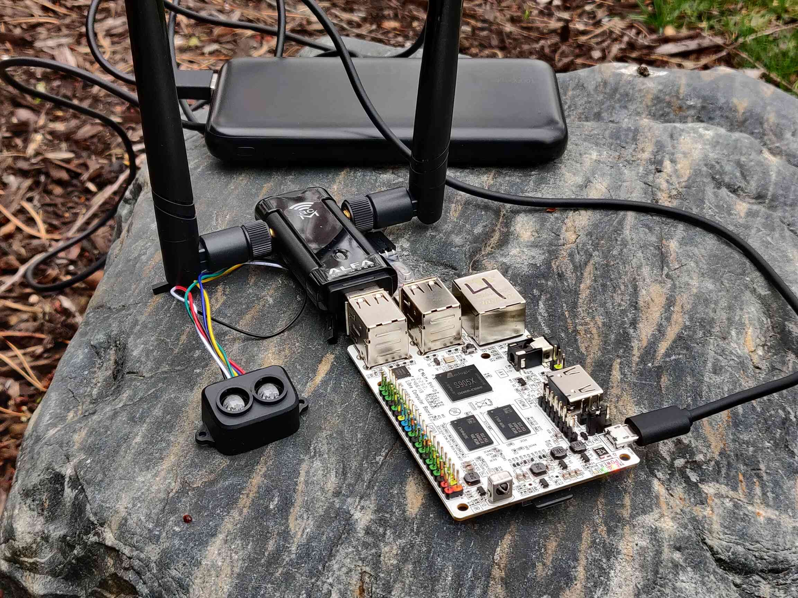

# Le-Potato setup



This is a guide to setting up all nodes using [Le Potatoes](https://libre.computer/products/aml-s905x-cc/).

> This guide will be assuming ubuntu 22.04 server, as described in the libre compute docs

## OS setup

1. When setting up 22.04 server, set eth0 to use DHCP in the cloud init config (before flashing)
2. Flash SD card as described in their docs
3. Connect Potato to Ethernet 
4. Install Docker
5. Add user to docker group
6. reboot
7. Clone timebay
8. Add a cronjob to enable uarta with: `ltdo enable uarta` on boot (must be in superusers crontab)
9. Delete /usr/lib/systemd/network/80-adhoc (If this is not done, then the wireless adapter will be dropped from bat0 if BATMAN is used)
10. Add a cronjob to run scripts/run_sensor_node.bash Node_ID or scripts/run_gateway_node.bash depending on node type on boot
    1. Ensure this node id is unique, or else the system will not work correctly
11. If setting up a gateway node, apply the kernel parameters:
     ```
     net.bridge.bridge-nf-call-iptables=0
     net.bridge.bridge-nf-call-ip6tables=0
     net.bridge.bridge-nf-call-arptables=0
     ``` 
    This can be done by adding a rule to sysctl.d, and adding a udev rule to load that rule when br_netfilters is loaded.
12. Finally, reboot with an ethernet cable connected to an uplink, and wait 10 minutes or so for the docker container to complete its first
    build. The potato is now ready!

## Running
To run the node after the above is setup:
1. Connect the Wi-Fi adapter to a usb port
2. Connect the TF-Luna to either GPIO or via a usb to UART converter (Timebay will select whichever is used)
3. Before powering on, ensure there is an object within 12m in front of the laser. If not, the laser will obtain a zero of 0, and not detect anything
   1. If this is not done correctly or the course is changed, simply correct the issue and zero the sensor via the GUI
4. Connect the potato to a power source, and wait ~3 minutes for it to boot and mesh

## Updating
To update the potato to the latest Timebay version:
1. Turn on the node with an ethernet cable connected
2. If Timebay on the node is not in sync with origin, then it will pull the changes and rebuild the correct Docker container
   1. This can take ~10 minutes, so go make a sandwich or something
3. You are now up-to-date!

## Troubleshooting
- If the blue LED on the potato is not blinking, then the board has died (it is solid when booting however)
  - This indicates a power issue, so you'll need to make sure your source has >1A of current @ 5v. USB cables have been an issue for me before, so check that too.
- To debug most networking issues, just connect the Potato to a monitor. Docker logs can display the sensor node executables output.
- If the gateway node has a working layer 2 but not layer 3, (IE wireshark shows ARP but not pings), ensure the kernel parameters were actually applied.

### Notes
- If you want to create many sensor nodes, it is possible to set one node up
, then copy that sd card to a file with `dd`, then copy that file back to another sd card with `dd`
. Just make sure to change the node id.
- Sensors connected to uarta will appear on /dev/ttyAML6. This interface does not have a udev id, so you'll just need to hardcode the path.
- Potatoes seem to be quite picky with power, although not as much as a pi. 1.5A mobile batteries and a quality usb cable seem to work for me, although it can still die if plugging in a keyboard.
- If you are using the reference image (not public atm) it is currently setup using the above guidelines. 
  - Username is ubuntu, and password is timebay