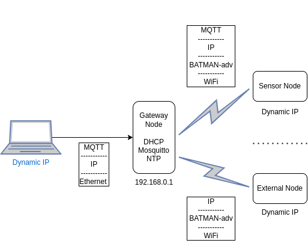

# Network

## Mesh (Layer 2)

A mesh network is created between all the sensor nodes and the gateway node.
This mesh is formed transparently at the link layer for all implementations. Notably, this means that timebay is really
running two routing protocols, one at layer 2, and one at layer 3.

Timebay currently offers two mesh implementations:

- 802.11s
- BATMAN-adv

### 802.11s

802.11s is the multi-hop mesh networking standard built into 802.11 itself. 802.11s requires driver support per
interface, so realistically only a few Wi-Fi chipsets on linux are easily capable of joining an 802.11s mesh, despite
its standardisation.

Theoretically, 802.11s should support more _device heterogeneity_ among the sensor nodes, since it can be implemented in
hardware
on something like an MCU. Due to its lack of open implementations however, this doesn't pan out for timebay, so all
nodes need
to be running linux.

Mesh support is super spotty, with some drivers that claim to support mesh point (rt2080) not fully implementing the protocol.

### BATMAN-adv

BATMAN-adv is a third party layer 2 meshing protocol that actually predates 802.11s.

The biggest downside with using BATMAN is that it is built into the linux kernel. While this is great for use on linux
SBCs
since any docker container can access it, this does lock us out of using an MCU for any mesh point.

What BATMAN does allow for however is much better handling of _network heterogeneity_, since it can operate over any
linux interface.
This means that under the hood BATMAN is really just a method of turning a series of single hop connections into a large
multi-hop network.
This means that it is possible to run BATMAN networks over ethernet or even bluetooth alongside 802.11, which provides
some exciting
possibilities. More practically though, this means that one can use IBSS mode stations rather than mesh ones, greatly
increasing the variety of network adapters usable.

Another nice feature of BATMAN is that it appears in linux just as a normal interface (commonly bat0). This makes it
nice
to debug, but also means that we can directly bridge the interface without anyone batting an eye. This is used on the
gateway
node, and works very smoothly.

Unfortunately, BATMAN-adv in my experience has issues with something causing massive packet loss. This may be an instance
of the hidden terminal problem, but I'm not certain. While this doesn't make BATMAN unusable, it nearly does.

## IP

To provide TCP/IP networking over the mesh (required for MQTT and clients), the gateway node will also host a DHCP
server.
All sensor nodes and clients will use this DHCP server to get addresses in the 192.168.0.0/24 range, while the gateway
node will have a static IP of 192.168.0.1/24 on its bridge interface.

Because the mesh network operates on layer 2, both ARPs and DHCP discover packets will flow throughout the network fine.

## Bridge

The gateway node bridges its mesh and ethernet interfaces to allow for the end client to both connect to the MQTT broker
and nodes in the mesh. This could be used for example to connect to a camera on the car from a laptop, to facilitate an
FPV setup.

## Time

Because our system relies on timestamps to ensure proper lap times, we need to ensure all sensor nodes have synchronised 
system clocks. To achieve this, the gateway serves NTP using chrony, spoofing a stra 1 server. This makes it an authoritative
NTP server (although it has no right to be) within the timebay network. This is fine, because the only thing that matters 
in our case is that the sensor nodes are synced relative to each other, not real time (or even the clients time). Chrony
is also run on the sensor and external nodes as a client to the gateway server, allowing for stepping the system clock
relatively aggressively, so we converge within the lifetime of the setup of a timebay session.  